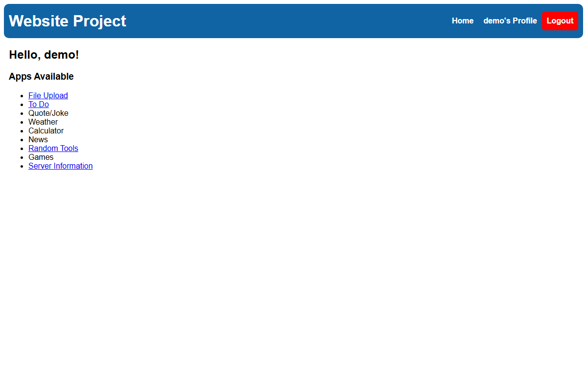
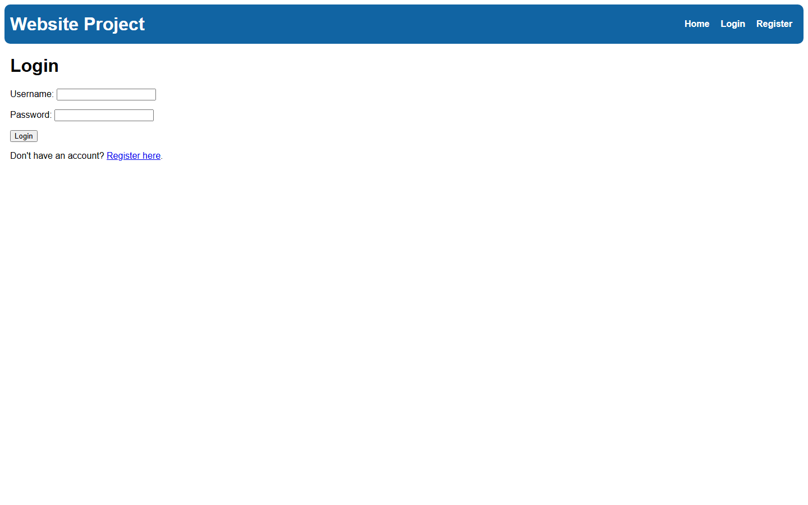
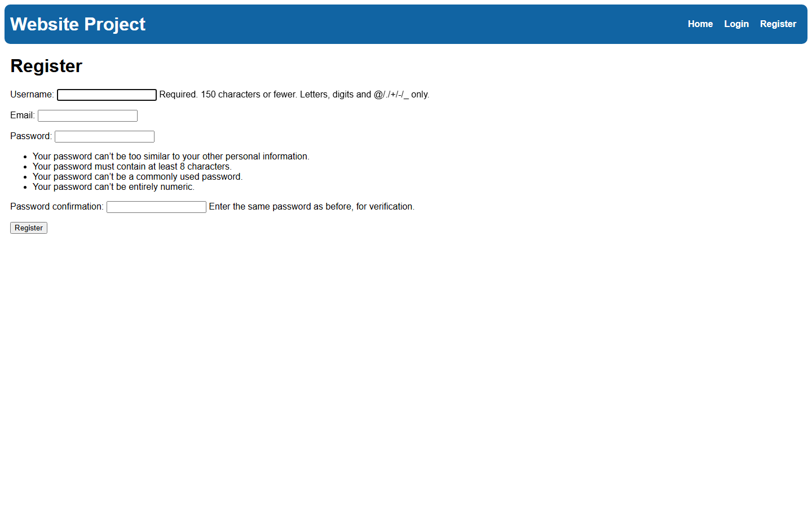
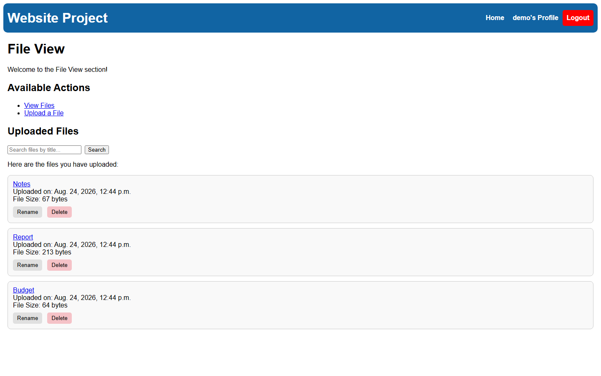
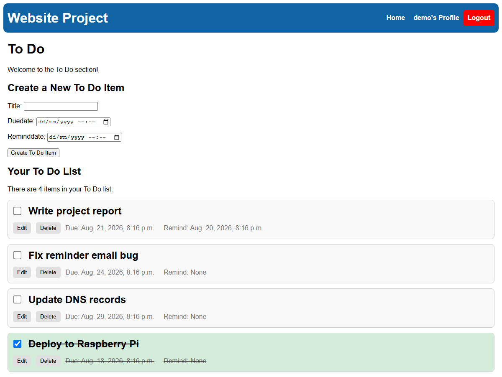
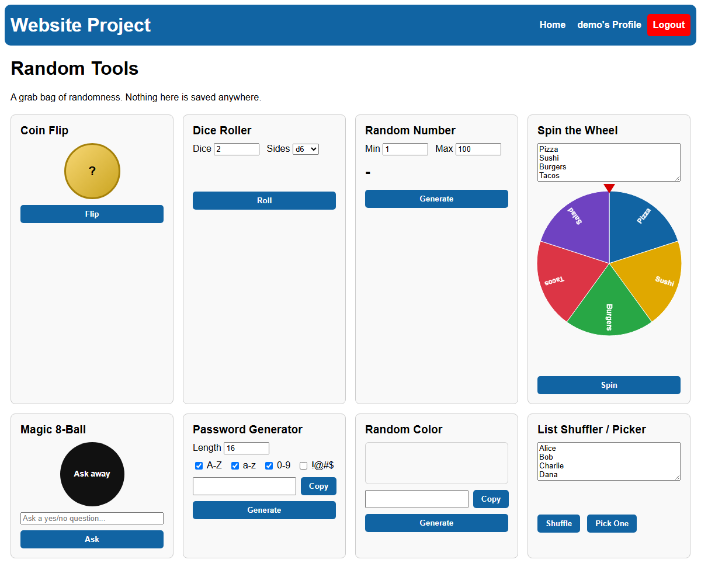
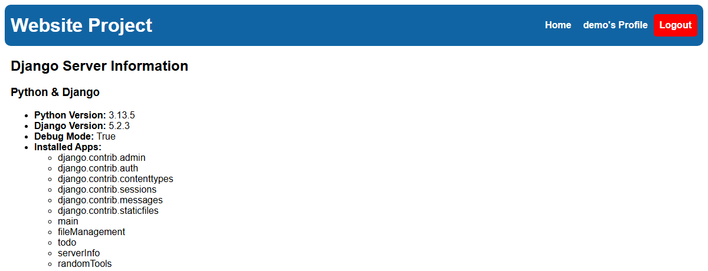

# websiteproject

Django site with accounts, per-user file storage, a to-do list, and a server
status page.

## Apps

- **main**: home page, register, login/logout, profile
- **fileManagement**: per-user file uploads/downloads
- **todo**: per-user to-do list with due dates and reminders
- **serverInfo**: server/system diagnostics page (staff only)
- **randomTools**: a grab-bag of client-side generators (coin flip, dice, password generator, and more)

## Screenshots

**Home**


**Login**


**Register**


**File Management**


**To Do**


**Random Tools**


**Server Info**


## Setup

```bash
python -m venv venv
source venv/bin/activate    # Windows: venv\Scripts\activate
pip install -r requirements.txt

cd websiteproject
python manage.py migrate
python manage.py createsuperuser
python manage.py runserver
```

Visit http://127.0.0.1:8000/.

## Config

`SECRET_KEY`, `DEBUG`, and `ALLOWED_HOSTS` are read from the environment (defaults
are fine for local dev, see `.env.example`). Copy `.env.example` to `.env` in the
repo root to set them locally; it's picked up automatically and gitignored.

`db.sqlite3` and `media/` are gitignored too, since they're local data not code.

Server Info (`/server/`) is staff-only since it shows the hostname, DB path, IPs
etc. Make a user staff via `createsuperuser` or the `is_staff` flag in `/admin/`.

## To-do reminders

Each to-do item has a remind date. Running

```bash
python manage.py send_reminders
```

emails users (at their account's email address) about any items whose remind
date has passed and haven't been reminded about yet. Without SMTP settings
configured (see `.env.example`), emails are printed to the console instead of
sent. Schedule this command periodically (cron, Task Scheduler, etc.) to have
reminders actually go out.
